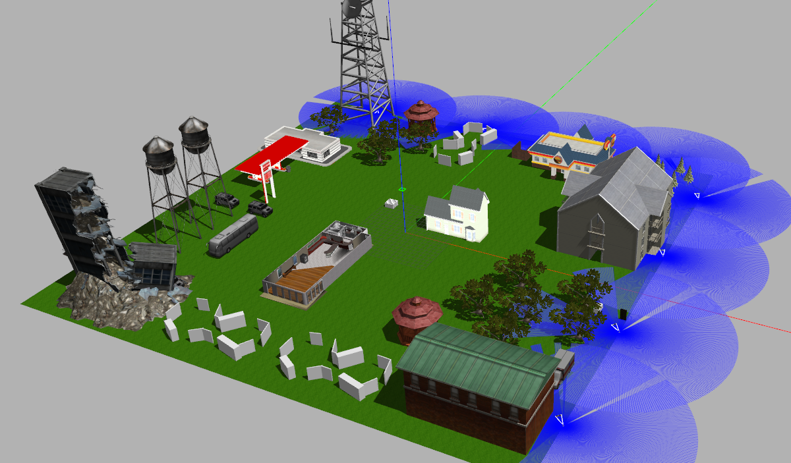
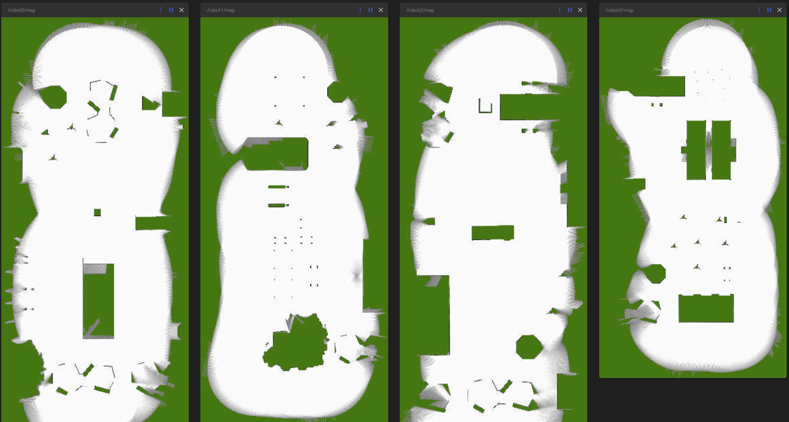
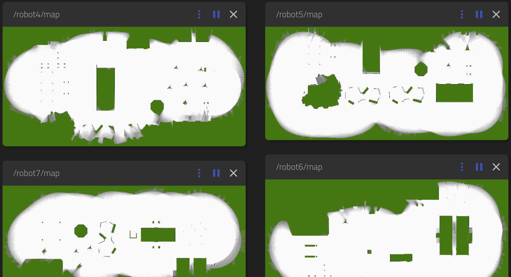

[](https://opensource.org/licenses/MIT)
# Distributed Byzantine-Tolerant Collabarative Mapping | Gazebo Sim

## Description
This ROS2 package provides a Gazebo simulation of our proposed Distributed Byzantine-Tolerant Collabarative Mapping smart contract. It is developed to demonstrate the applicabilty of collective decision making algorithm in the multi-robot system to the distributed ledger technology. This package is not intended to provide a state of the art collabarative mapping solution. 

In this simulation enviornment, there are 8 Turtlebot3 (waffle) robots navigating the whole area based on a predifined path. On top of each robot a 2D lidar is installed. Based on 2D lidar data and odometry published by Gazebo we run Cartographer ros for each robot.

Finally, when each robot finished their navigation, they'll publish a message on `/mapping_done` topic. The `controller_agent` node receives these messages and send them for an python-implementation of our smart contract. We will publish the Solidity and Go implemetations for Ethereum and IOTA respectively on another repository.




This simulator uses parts of [ AUVSL / UWB-Jackal-World ](https://github.com/AUVSL/UWB-Jackal-World) and [Multi-robot UGVs+UAVs with UWB | Gazebo Sim](https://github.com/TIERS/mrs-uwb-sim).


## Dependencies
You should have a full installation of ROS2 (including Gazebo + Rviz2). This package is developed and tested on `foxy`.

Note: If you are using another version of ROS2 replace `foxy` with your version.
```
sudo apt install ros-foxy-cartographer-ros ros-foxy-robot-state-publisher ros-foxy-turtlebot3-description ros-foxy-gazebo-ros
```

## Installation
Create a ROS2 workspace:
```
mkdir -p ~/collab_mapping_ws/src
cd ~/collab_mapping_ws/src
```
Clone this repository:
```
git clone git@github:TIERS/collab_mapping.git
```
Then you should build it with `colcon`:
```
cd ~/collab_mapping
colcon build
```

## Launch Simulation
To launch the simulation:
```
cd ~/collab_mapping_ws
source install/setup.bash
ros2 launch collab_mapping true_world.launch.py
```
Now you can see the Cartographer outputs on `/robot{i}/map` topic (For example for robot1 it will be `/robot1/map`). For visualization you can use Rviz2 or [Rosboard](https://github.com/dheera/rosboard).

Then you should run the smart contract:
```
ros2 run collab_mapping run_sc
```
The final merged map will be published on `/map` topic.

## Results
Maps created by each robot visualized by `rosboard`.


